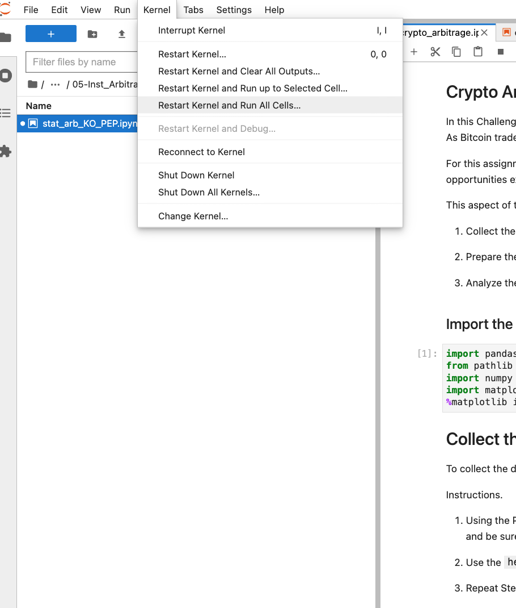

# Crypto Arbitrage Analysis

## Table of Contents

1. Project Motivation
2. About the Application
3. Techologies Used 
4. Installation Guide
5. File Descriptions
6. Contributors
8. License

## Project Motivation

This project is in completion of the Columbia University FinTech 2022 bootcamp module three weekly challenge exercise. 

---

## About the Application

This app perform analysis on Bitcoin price traded in two different markets. It shows the profit opportunities given the Arbtrage Profit spread - the difference in  price of a stock traded in different markets at the same period.

---

## Technologies Used
The application is written in python programming langauge. Users need a device that can run python3 applications. 
Other python applications, libraries and frameworks used in this project include:

1. jupyterlab

See requirements.txt for list of all libaries used.

---

## Installation Guide

Follow steps in this link https://jupyterlab.readthedocs.io/en/stable/getting_started/installation.html to install jupyterlab
     

---

## File Descriptions 
Files included:
1. Data folder:
    - Starter_Code/Resources/bitstamp.csv
    - Starter_Code/Resources/coinbase.csv
2. Images
    - how_to_run.jpg   

3. Application and libriaries. 
   - Starter_Code/crypto_arbitrage.ipynb
   - Starter_Code/requirements.txt
4. README.md


## How to Run
1. Clone this repo 
``` git clone https://github.com/ruejo2013/fintech_module_3.git ```

2. On your terminal navigate to the file location 

```
    cd <location of file>
    conda create -n <evn_name> python=3.7 
    conda activate <evn_name>
    git clone <link to repo>
    pip install -r requirements.txt

```
3. Open crypto_arbitrage.ipynb on jupyterlab in the conda env just activate.  

```
on jupyterlab click kernel (top left on menu bar)

click 'Restart kernel and Run all cells'
```


This will run the notebook, generate some charts, and statistical analysis on the Bitcoin stock price for different dates, and periods, trading on two markets.


## Contributors

This project is in collaboration with the Columbia University FinTech 2022 bootcamp team, and extended by Patrick R. For questions and comments kindly contact Patrick via email on pruejoma@gmail.com

---

## License

This project is in completion of the Columbia University FinTech 2022 bootcamp module three weekly challenge exercise. It should not be copied and used for commercial purpose without the authorization of the admin of this repo. For futher information please contact Patrick via email on  pruejoma@gmail.com
